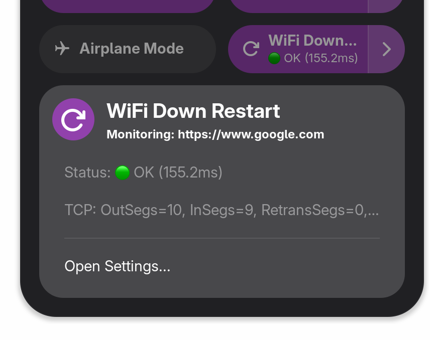

# WiFi Down Restart

A lightweight connection monitoring tool and GNOME Shell Extension created to restart the internet connection on unstable networks (absolutely not related to some specific university wifi randomly dropping the connection after 20 minutes). It periodically probes a target URL and automatically power-cycles the Wi-Fi interface if the connection drops.

## Features

- **DNS Timeout Protection**: Uses custom DNS resolution via `dnspython` to force strict timeouts on DNS queries, preventing the monitor loop from hanging when the Wi-Fi's DNS server stops responding.

- **Automatic Recovery**: Power-cycles the Wi-Fi radio (using nmcli or DBus NetworkManager calls) when the probe transitions from active to inactive.

- **SSID Filtering**: Restricts connectivity monitoring to a specified list of Wi-Fi networks (skips monitoring on public or hotspot networks).

- **GNOME Shell Extension**: Adds a quick settings toggle with a status submenu and a native settings preferences page.

---

## Standalone Python Usage

Ensure you have your dependencies installed via `uv` or `pip`:

```bash
uv sync
```

Run the monitor script:

```bash
.venv/bin/python main.py [URL] [OPTIONS]
```

### Options:

- `--interval INTERVAL`: Time between checks in seconds (default: 30).
- `--timeout TIMEOUT`: Timeout for connection probe in seconds (default: 5).
- `--notify`: Send desktop notifications on connection status changes.
- `--restart-wifi`: Enable Wi-Fi radio power-cycling on connection drops.
- `--restart-wifi-strategy {auto,dbus,nmcli}`: Choose the method to restart Wi-Fi.
- `--wifi-filter SSIDS`: Comma-separated list of Wi-Fi SSIDs to restrict monitoring to.
- `--recheck`: Perform a secondary connection recheck probe before executing a Wi-Fi restart.
- `--recheck-delay DELAY`: Delay in seconds to wait before performing the secondary check (default: 1.5).

### Timing Heuristics & Recheck Mechanism

To prevent unnecessary and disruptive Wi-Fi restarts from transient drops (e.g., temporary packet loss), the tool utilizes the following timing settings:
- **Probe Interval**: The baseline frequency of the network status check.
- **Probe Timeout**: The strict timeout for DNS resolution and TCP socket establishment.
- **Recheck Delay**: When a probe fails, the monitor pauses for this duration (default: `1.5s`) and retries the connection. If the retry succeeds, the connection is treated as recovered, and the Wi-Fi restart is skipped.

---

## GNOME Shell Extension (GNOME 45+)



The bundled GNOME extension provides a native wrapper for the Python script.

### Local Installation

1. **Compile Settings Schema**:

   ```bash
   glib-compile-schemas wifi-down-restart/schemas/
   ```

2. **Symlink to GNOME Extensions Directory**:

   ```bash
   mkdir -p ~/.local/share/gnome-shell/extensions/
   ln -srf wifi-down-restart ~/.local/share/gnome-shell/extensions/wifi-down-restart@aziis98.github.io
   ```

3. **Reload GNOME Shell**:
   - **Wayland**: Log out and log back in.
   - **X11**: Press `Alt` + `F2`, type `r`, and press `Enter`.

4. **Enable the Extension**:
   ```bash
   gnome-extensions enable wifi-down-restart@aziis98.github.io
   ```
   _Alternatively, search for and enable "WiFi Down Restart" in the **Extensions** or **Extension Manager** application._

### Viewing Logs

To view the real-time output of the monitoring script spawned by the GNOME extension, run:

```bash
journalctl /usr/bin/gnome-shell -f -o cat | grep "wifi-down-restart"
```

---

## License

This project is licensed under the MIT License - see the [LICENSE](LICENSE) file for details.
